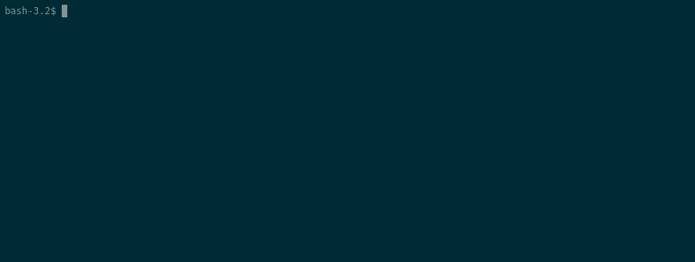
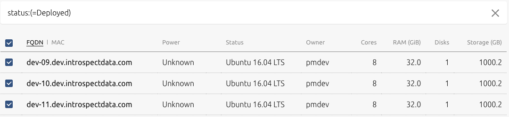

# Bare Metal Kubernetes

We see this project both as a proof of concept, but also as a lab and a great way to learn the basics of operating a [Kubernetes](https://kubernetes.io) (k8s) cluster.



### TL;DR; - getting things running

* [ ] - Set up MaaS and hardware
* [ ] - Install `python3`, `virtualenv` and `virtualenvwrapper`
* [ ] - Install requirements for this project in a `virtualenv`
* [ ] - Set environment variables for MAAS:
    * `MAAS_API_URL`
    * `MAAS_API_KEY`
* To run iteratively and measure results:
    * use the `./iterate.py` python script
* To run process from end to end without timing/etc:
    * use the `./_run.sh` bash script

### Why bother?

It's important to start from the position of understanding 'why'. In our case, we had a bunch of hardware sitting around and it felt like a waste to let it just sit there, but additionally, a number of our clients have pretty much the same situation - hardware they already own (or lease, or otherwise are already paying for) that may not make for the best production K8s system in the world, but it's a great way to learn and even run development environment(s) from.

### Resources

There are a couple of great walkthroughs focused on bare metal K8s that use a myriad of techniques:

* [Josh Rendek's](https://joshrendek.com/2018/04/kubernetes-on-bare-metal/) awesome walkthrough
* [Alex Ellis'](https://blog.alexellis.io/kubernetes-in-10-minutes/) (of [OpenFaaS](https://blog.alexellis.io/tag/learn-openfaas/) fame) walkthrough
* Kubernetes' walkthroughs:
    * Fedora - [Single Node](https://kubernetes.io/docs/getting-started-guides/fedora/fedora_manual_config/) and [Multi Node](https://kubernetes.io/docs/getting-started-guides/fedora/)
    * Ubuntu - [LXD](https://kubernetes.io/docs/getting-started-guides/ubuntu/local/), [Juju](https://kubernetes.io/docs/getting-started-guides/ubuntu/installation/), [Rancher](https://kubernetes.io/docs/getting-started-guides/ubuntu/rancher/)

These are ALL great resources. We have a few specific capabilities we're shooting for that we outline on a per-section basis.

We broke the process into a few main chunks:

* 'Lights Out' to Operating System 'up and running'
* Base OS to 'ready for K8s'
* K8s installation
* K8s Basic Configuration  

### Before we start...

There were some core technology choices we made in getting this 'thing' put together.

* Cannonical's [Metal as a Service](https://maas.io/) for hardware provisioning/management
    * We'll share more on this in the hardware-level management layer section below
* [Ansible](https://github.com/ansible/ansible) for configuration management
    * Running remote commands with a way to share data centrally was critical to coordinating cluster deployment(s)
    * We also ended up leveraging a custom [dynamic inventory](https://docs.ansible.com/ansible/latest/user_guide/intro_dynamic_inventory.html) script so we could use [tags](https://docs.maas.io/2.1/en/installconfig-nodes-tags) within MaaS to identify cluster roles.
* Python to glue it together...
    * Ansible is based on Python... and there are a few [API clients](https://github.com/maas/python-libmaas) pre-baked for Python MaaS as well..
    * It also offers some cool opportunities to generate configurations for our networking gear, etc.
    * We use `[virtualenv](https://virtualenv.readthedocs.io/en/latest/)` and `[virtualenvwrapper](https://virtualenvwrapper.readthedocs.io/en/latest/)` to manage our python environment(s) locally:
        * `mkvirtualenv -p python3 maas`

## Hardware-level management layer - Ubuntu Metal as a Service

Our first set of requirements looks a lot like that of what public cloud Infrastructure as a Service (IaaS) providers offer:

* API driven deployment and re-deployment of 'instances'
* API or at least 'HTTP accessible' power management
* Ability to handle entire 'cold start' hardware deployment
    * 'Completely off' (no power) to up and running

We looked at a few options and ended up with using Cannonical's [Metal as a Service](https://maas.io/) (MaaS) to deploy Ubuntu on hardware via [PXE Boot](https://en.wikipedia.org/wiki/Preboot_Execution_Environment).

* [CoreOS' Matchbox](https://github.com/coreos/matchbox) solution is pretty cool too...
    * We were looking for as few 'moving parts' as possible in the early stage and Matchbox doesn't quite hit all the 'cold boot' checkboxes we'd have liked.
    * This might work really well in a VMWare-based environment where you put the instance provisioning process in front of Matchbox in the workflow

MaaS also offers a more 'elastic' setup where it can manage KVM instances in 'Pods'. Want to really move fast? Check out how to set up pods in their [tutorial](https://tutorials.ubuntu.com/tutorial/create-kvm-pods-with-maas#0). We were even able to this out on machines we provisioned via MaaS!

### Prerequisites/Setting up MaaS

We're assuming that the MaaS basic setup documentation is 'enough' to get you moving. That being said, the minimum viable setup to have 3 k8s nodes (1 master, 2 nodes) is something along the lines of:

* 3 machines that are configured for network boot via PxE (Bios/Boot setting)
    * No joke, our first setup used 3 'old' [Dell OptiPlex 7010](https://www.dell.com/support/article/id/en/idbsd1/sln285337/dell-optiplex-7010-system-guide?lang=en) desktops  
* 1 machine to run MaaS
    * Again, no joke, we used a [Zotac ZBOX CI323](https://www.zotac.com/us/product/mini_pcs/zbox-ci323-nano)... we've since set up MaaS properly :)
    * hey.. it has 2 nics (which we bonded) and we dumped an SSD in it... it works.  
* A supported power management device (or [IPMI](https://en.wikipedia.org/wiki/Intelligent_Platform_Management_Interface)-enabled server)
    * Since we didn't use servers, we picked up some [Digital Loggers](http://digital-loggers.com/) PDUs... they work really well for us!
        * We've tried both their [Web Power Switch](https://dlidirect.com/products/web-power-switch-7) and [Universal Input PDU](https://dlidirect.com/products/universal-input-voltage-pdu)
* Since MaaS acts as the [DHCP](https://en.wikipedia.org/wiki/Dynamic_Host_Configuration_Protocol) server, you'll want to configure your network so that this can happen.
    * We just set up a separate VLAN and set it up without a DHCP server ...
* If you can 'deploy' a machine and you get a functioning Ubuntu server, you're ready to actually get started.

Here's what our basic setup looks like:



## Hardware Provisioning

Assuming that you've got MaaS up and running, we'll need to get a few things configured:

* Set up your python environment (`virtualenv` and `virtualenvwrapper` are assumed):
    * `pip install -r requirements.txt`
* Go grab your MaaS API key and host/url details - it's used by the Ansible dynamic inventory script to hit the MaaS API.
    * Our `maas` file pulls values from the environment for `MAAS_API_KEY` and `MAAS_API_URL`
* In MaaS, tag your machines with our 'arbitrary' (semi-configurable in the `maas` file) tags:
    * `k8s-master` for your (minimally) single master
    * `k8s-node` for the rest of the machines you're setting up.

Cycling/testing the hardware-level provisioning looks a little something like this:

```bash
export MAAS_API_URL=http://172.16.16.2:5240/MAAS
export MAAS_API_KEY=apikeygoeshere
./maas --reset
```

Output from the `--reset` command will be [released](https://docs.maas.io/2.5/en/intro-concepts#release) and then [deployed](https://docs.maas.io/2.5/en/intro-concepts#deploy).

5-6 (ish) minutes later, you should see something like this:

```bash
(maas) pmdev13:k8s-baremetal pmdev$ ./maas --reset
Starting reset process at 2018-10-09 20:48:44.443620
Releasing host - dev-09
Releasing host - dev-10
Releasing host - dev-11
Hosts have reached Ready state: ['dev-09', 'dev-10', 'dev-11']
Deploying Host - dev-09
Deploying Host - dev-10
Deploying Host - dev-11
0 of 3 hosts ready to deploy
0 of 3 hosts ready to deploy
0 of 3 hosts ready to deploy
1 of 3 hosts ready to deploy
Hosts have reached Deployed state: ['dev-09', 'dev-10', 'dev-11']
Process complete at 2018-10-09 20:55:04.924346
MaaS cycle time - 380.480726 seconds
```

**Some cycle times from testing while writing this document**:

## Ansible Playbook Sequencing

### Base OS to 'Ready for k8s'

Everything to prep the machines to get them ready for Kubernetes is contained within the `k8s-01-base.yaml` playbook.

Once we have an OS, setting things up to run Kubernetes is ... pretty straightforward. Since we're using Ansible as our configuration management tool, the process of getting things moving are easy enough to follow:

* Add a few specific repositories for packages and tools we'll need to install
    * Docker
    * Kubernetes
* Actually install programs and tools including:
    * `kubeadm`
    * `kubelet`
    * `docker-ce`
* Remove and [disable swap](https://serverfault.com/questions/881517/why-disable-swap-on-kubernetes) per kubelet requirements
* install [`helm`](https://github.com/helm/helm) binaries on master


### K8s Installation

The `k8s-02-install.yaml` playbook handles actually initializing the kubernetes cluster master and nodes. We use [`kubeadm`](https://kubernetes.io/docs/setup/independent/create-cluster-kubeadm/) to get that done.  Of specific import, our configuration is a bit opinionated:

* Single master cluster
* The first IP assigned to the master (in MaaS via the MaaS API in our dynamic inventory) is used to configure the master API address
* We don't add a ton of special configs... but all configs are in the `vars/k8s_config.yaml`
* We do apply a few very basic manifests:
    * Weave network overlay
    * Service account for Helm Tiller to use
    * Then we run `helm init` to make sure we're ready to deploy more stuff!
* While it's a little 'hack-ey' we also write out a variable file at `vars/k8s_master.yaml` that contains the master IP so we can use it in downstream playbooks

### K8s Basic Configuration

The `k8s-03-install.yaml` playbook installs a bunch of stuff to the `kube-system` namespace:

* [Storage Class](https://kubernetes.io/docs/concepts/storage/storage-classes/) setup for NFS servers (we have 2 for dev purposes...)
    * We use the [stable/nfs-client-provisioner](https://github.com/helm/charts/tree/master/stable/nfs-client-provisioner) helm chart
* [nginx-ingress](https://github.com/helm/charts/tree/master/stable/nginx-ingress) to handle inbound connections bound to the master node's IP address
* Monitoring charts
    * [Prometheus](https://github.com/helm/charts/tree/master/stable/prometheus/)
    * [Grafana](https://github.com/helm/charts/tree/master/stable/grafana/)

### Local Access Configuration

The `k8s-04-localhost.yaml` playbook grabs a `kubeconfig` file from the master, copies it locally and then merges any existing config file before placing it in `~/.kube/config`.
